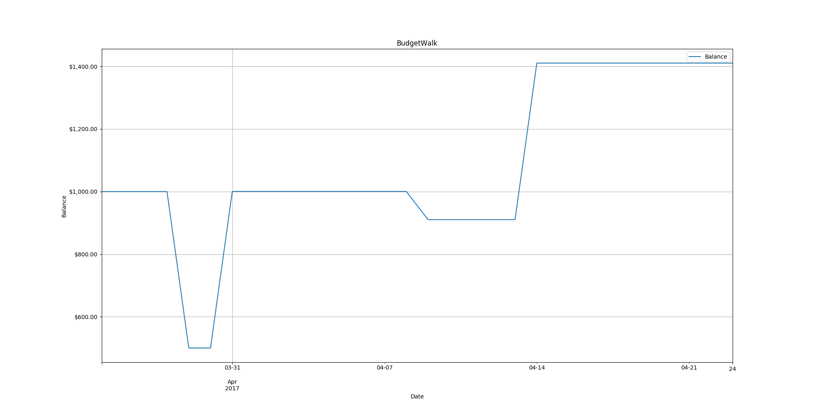

# BudgetWalk

BudgetWalk allows you to visualize your balance over time with only a starting balance and a budget plan.  The budget CSV is currently as simple as a `dayOfMonth` and a `delta`.  Each line instructs the balance to change by the specified delta value on the specified day of the month.

## Example

```
dayOfMonth,delta
1,500.00
8,-90.00
15,500.00
30,-600.00
```


